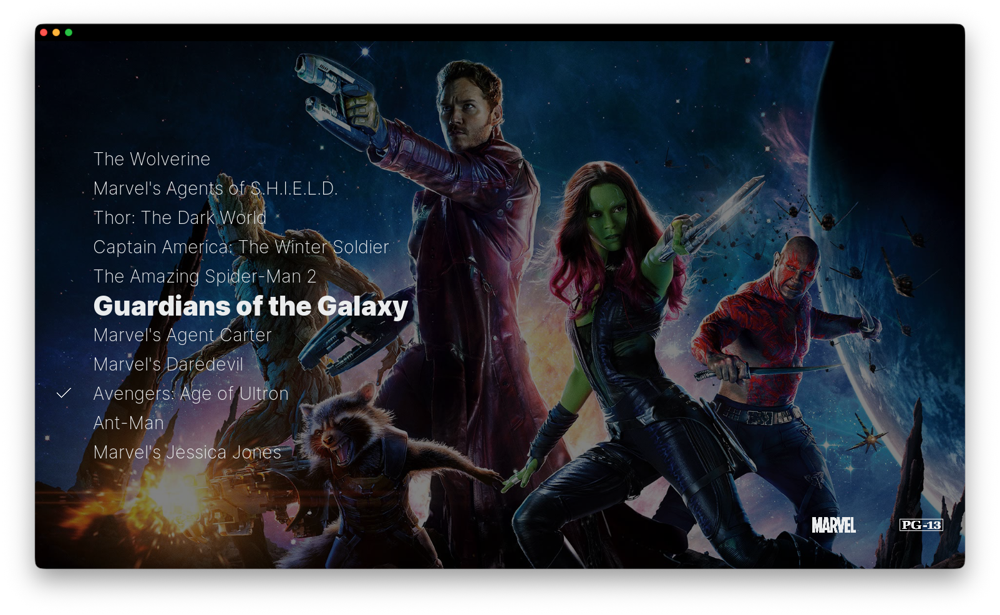
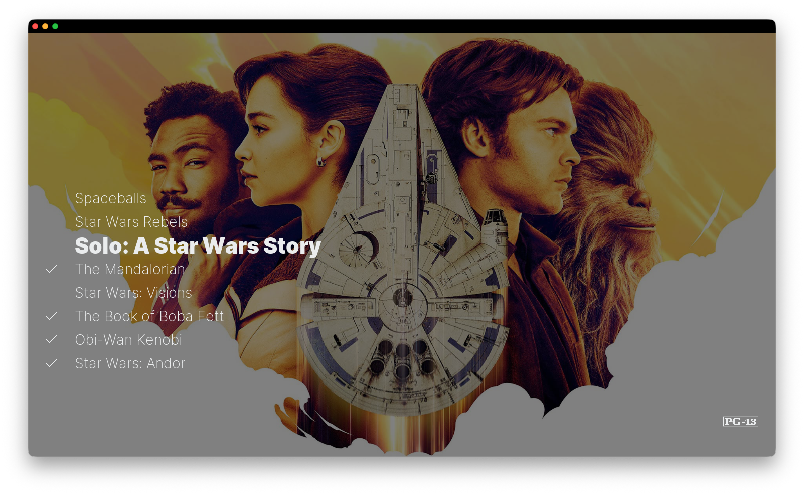

# Cinematic Collections

Kodi addon that lets you build your own collections mixing movies and TV shows
from your library, in the order you choose. Useful for franchises that span
both formats — Marvel Cinematic Universe, Star Wars, the Wizarding World, the
DC Extended Universe — or for any custom list you want to keep around (a
"to-watch with my partner" list, "best of the year", etc.).

Built and tested on Kodi Omega (v21).



*The "Marvel Cinematic Universe" collection rendered with the Copacetic skin in fanart view. Movies and TV shows are mixed in the user's chosen order; the focused item's fanart drives the background; watched items show a checkmark next to their title.*



*The "Star Wars" collection — same view as above, with checkmarks on items that have already been watched. The watched state is read fresh from the Kodi library on every open, so the indicators are always up to date.*

## What it does

- Adds a context-menu entry "Add to collection…" on every movie and TV show
  in your library.
- Provides a video plugin (Add-ons → Video add-ons → Cinematic Collections)
  where you create, browse, rename and delete collections.
- A collection's contents are rendered as a normal Kodi list — movies play
  directly, TV shows drill down into seasons/episodes like in the standard
  library. Watched state is always fresh.
- Items keep the order in which you add them; reorder via "Move up" / "Move
  down" in the context menu of each item.

## Installing

The recommended way is through the
[`neverbot/kodi-addons` repository](https://github.com/neverbot/kodi-addons),
which gives you automatic updates whenever a new version of this addon (or
any other neverbot addon) is published. One-time setup:

1. Download the
   [repository add-on zip](https://neverbot.github.io/kodi-addons/repository.neverbot/repository.neverbot-1.0.0.zip).
2. In Kodi: **Settings → Add-ons → Install from zip file** → pick the
   file. (You may need to enable "Unknown sources" first.)
3. **Settings → Add-ons → Install from repository → neverbot's Kodi
   add-ons → Video add-ons → Cinematic Collections → Install**.

Kodi pulls updates from the repository on its normal schedule (about once
an hour); no further action needed when new versions are released.

### Manual install (without the repository)

If you'd rather skip the repository step, you can grab the addon zip
directly and install it as a one-off:

1. Download the latest zip from the
   [Releases page](https://github.com/neverbot/plugin.video.cinematic.collections/releases)
   (or from <https://neverbot.github.io/kodi-addons/>, which always lists
   the current version).
2. In Kodi: **Settings → Add-ons → Install from zip file** → pick it.

Manual installs do not get auto-updates; you'll have to repeat this each
time you want to bump versions.

## Using

**Create your first collection**: in the Kodi library, navigate to any movie
or TV show, open its context menu (key `c`, right-click, or the equivalent on
your remote), pick "Add to collection…", then "+ Create new collection". Give
it a name. The item is added.

**Add more items**: same context menu on any movie/TV show, pick the
collection from the list.

**Browse a collection**: Add-ons → Video add-ons → Cinematic Collections →
pick a collection. Movies and TV shows show up mixed in the order you added
them.

**Reorder**: open the context menu on an item inside a collection. "Move up"
and "Move down" reorder it relative to its neighbours.

**Remove an item**: same context menu, "Remove from collection".

**Refresh metadata**: artwork, plot, etc. are cached when you add an item.
If you re-scrape something and want the collection to reflect the new data,
right-click the item or the whole collection and pick "Refresh metadata".

## Adding a shortcut to the home menu

The plugin lives under Add-ons → Video add-ons by default. The way to put
your collections on the Kodi home screen depends on which skin you use.

### Estuary (the default skin shipped with Kodi)

Estuary's home menu only exposes toggles for its built-in items (Movies, TV
shows, Music, Add-ons, Favourites…); it does **not** let you add a custom
item pointing to a plugin path. The workaround is to add each collection as
a Kodi favourite — those show up under the **Favourites** entry on the home
screen.

1. On the Kodi home screen, go to **Add-ons**.
2. Find **Cinematic Collections** in the list and select it. You land on
   the addon's information page.
3. Press **Open** (the rocket button on the left). The list of your
   collections appears.
4. Focus the collection you want a shortcut for, open its context menu and
   pick **Add to favourites**.
5. Make sure the **Favourites** item is enabled in
   Settings → Interface → Skin → Configure skin → **Main menu items**.
6. From now on, that collection is reachable from home → Favourites in one
   click. Repeat for as many collections as you want.

### Other skins (Copacetic, Aeon Nox, Arctic Zephyr, Amber, Estuary MOD V2, etc.)

Most third-party skins **do** support adding arbitrary items to the home
menu, and that is the cleanest way to integrate Cinematic Collections —
typically you can put a "Collections" entry next to "Movies", "TV shows",
"Music", etc., and even attach a widget that previews the contents of one
of your collections.

Each skin has its own home-menu editor, reachable from the skin's settings
or by opening the context menu on a home-screen item. Consult your skin's
documentation for the exact path. The action target you need to enter is
always the same:

```
ActivateWindow(Videos,plugin://plugin.video.cinematic.collections/,return)
```

If your skin's editor lets you browse to an add-on visually instead of
typing this string, navigate to **Add-ons → Video add-ons →
Cinematic Collections** and pick that — the editor will fill the action
in for you.

## How it stores things

A single JSON file under your Kodi profile:

```
<profile>/addon_data/plugin.video.cinematic.collections/collections.json
```

Each item caches enough metadata (title, year, art, plot, file path, etc.) to
render the listing without hitting the library every time. Watched state is
read fresh on every open via two cheap bulk JSON-RPC calls — so the watched
indicators are always current, but everything else is cached and the addon
opens instantly even on Kodi setups using a remote MariaDB shared library.

## Development

```sh
git clone git@github.com:neverbot/plugin.video.cinematic.collections.git
ln -s "$PWD/plugin.video.cinematic.collections" \
      "$HOME/Library/Application Support/Kodi/addons/plugin.video.cinematic.collections"
```

(Adjust the addon path for your platform.) Restart Kodi or use Settings →
Add-ons → My add-ons → Cinematic Collections → Disable / Enable to pick up
Python changes — Kodi caches `.pyc` files in memory.

## License

MIT — see [LICENSE](LICENSE).
